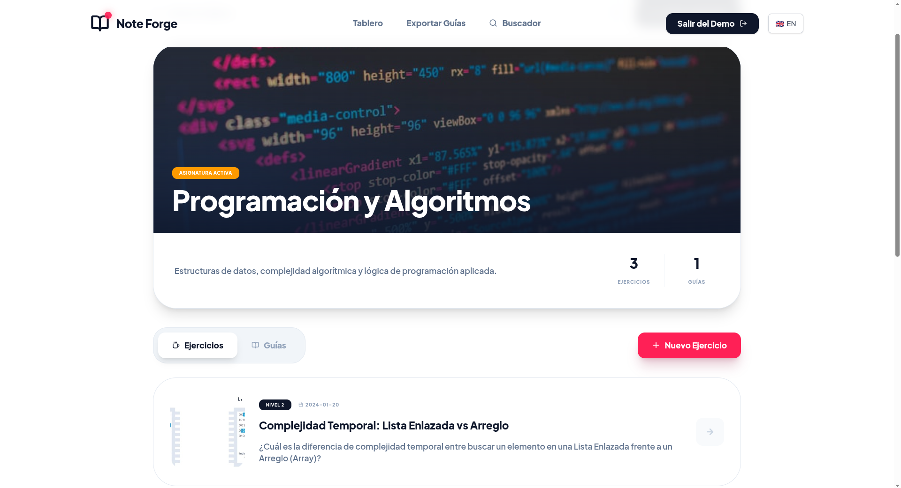
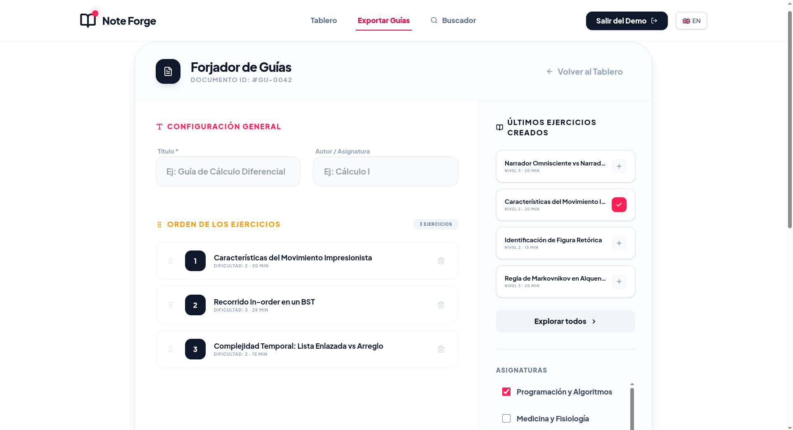

<div align="center">

# 📚 Note Forge

> 🌍 [Read in English](./README.md)

**Aumenta la productividad de estudiantes y educadores con material de estudio centralizado**

[](https://reactjs.org/)
[](https://www.typescriptlang.org/)
[](https://nodejs.org/)
[](./LICENSE)

Note Forge es una app web donde puedes almacenar ejercicios, etiquetarlos por asignatura y dificultad, y arrastrarlos para armar guías de estudio exportables en LaTeX.

[🎮 Demo en vivo](https://xhandlr.github.io/note-forge) · [✨ Funcionalidades](#-funcionalidades) · [📖 Documentación](#-primeros-pasos) · [🐛 Issues](https://github.com/xhandlr/note-forge/issues)

</div>

---

## 🎯 Descripción general

Note Forge nació de una necesidad real: como tutora en mi universidad, perdía demasiado tiempo buscando ejercicios, imágenes y referencias para armar guías de estudio para mis estudiantes. Con material de distinta dificultad, formato y procedencia, el proceso era ineficiente. Note Forge resuelve eso.

### Ideal para

| Rol | Cómo ayuda |
|-----|-----------|
| 🎓 **Estudiantes** | Centraliza todo el material de estudio — ejercicios, imágenes y respuestas — en un solo lugar |
| 👨‍🏫 **Ayudantes** | Arma guías de estudio desde un banco de ejercicios existente con drag-and-drop |
| 👨‍💼 **Profesores** | Soporte LaTeX para distribuir ejercicios en distintas asignaturas y exportar guías con facilidad |

### Aspectos destacados

- 🎨 **UX moderna** — paleta de colores rose, amber y slate con interfaz limpia y animada
- 🌍 **Soporte i18n** — traducciones completas en inglés y español
- 🎮 **Demo interactiva** — sin registro, sin Docker, sin backend. [Pruébala aquí](https://xhandlr.github.io/note-forge)

---

## ✨ Funcionalidades

### 📝 Gestión de ejercicios
- **Editor LaTeX** — renderizado en tiempo real para ecuaciones, matrices y notación científica con resaltado de sintaxis
- **Metadata enriquecida** — escala de dificultad de 5 niveles, estimación de duración, etiquetas múltiples, imágenes personalizadas y referencias
- **Búsqueda avanzada** — filtra ejercicios por asignatura, dificultad o si incluyen imágenes

### 🎯 Constructor de guías de estudio
- **Drag & Drop** — reordenamiento intuitivo con animaciones fluidas
- **Espacio de trabajo unificado** — panel triple: biblioteca de ejercicios, metadatos de la guía y vista previa en vivo
- **Métricas automáticas** — cálculo de tiempo total (15 min/ejercicio) y dificultad promedio con indicadores visuales
- **Opciones de exportación** — guarda borradores y exporta a formato LaTeX (`.tex`)

### 📁 Sistema de categorías
- **Organización flexible** — categorías por asignatura con imágenes personalizadas, descripciones y anidamiento libre
- **Vistas dedicadas** — secciones hero con portadas, interfaz con pestañas (ejercicios vs. guías) y opción de pinar asignaturas favoritas

### 🌍 Internacionalización y demo
- i18n completo en inglés y español
- Demo interactiva con datos de muestra precargados — sin configuración previa

---

## 🎨 Capturas de pantalla

<div align="center">

**Dashboard**


**Categorías**


**Guías**


**Exportar**


</div>

---

## 🛠️ Stack tecnológico

### Frontend

| Tecnología | Versión | Propósito |
|-----------|---------|-----------|
| React | 18.3 | Biblioteca UI con hooks y componentes funcionales |
| TypeScript | 5.5 | Tipado estático y mejor experiencia de desarrollo |
| Vite | 5.0 | Build tool con HMR instantáneo |
| TailwindCSS | 3.4 | Framework CSS utility-first |
| React Router | 6.x | Enrutamiento client-side con rutas anidadas |
| react-i18next | 16.0 | Solución i18n completa con detección de idioma |

### Backend

| Tecnología | Versión | Propósito |
|-----------|---------|-----------|
| Node.js | 22+ | Runtime JavaScript con soporte ES modules |
| Express | 4.x | Framework web minimalista y rápido |
| MySQL | 8.0+ | Base de datos relacional con soporte JSON |
| JWT | 9.x | Tokens de autenticación sin estado |
| bcrypt | 6.0 | Hashing de contraseñas |

### Arquitectura y DevOps
- Context API para estado global
- Custom hooks para lógica reutilizable
- Docker & Docker Compose para contenedores
- GitHub Pages para el despliegue del demo

---

## ⚡ Primeros pasos

### Inicio rápido (Demo)

La forma más rápida de explorar Note Forge — sin configuración:

1. Entra a [xhandlr.github.io/note-forge](https://xhandlr.github.io/note-forge)
2. Haz clic en **"Probar sin registrarse"** en la página de inicio
3. Explora todas las funcionalidades con datos de muestra precargados

El demo incluye categorías preconfiguradas, ejercicios con LaTeX, guías con drag-and-drop y búsqueda completa.

---

### Requisitos

Para desarrollo local:

- ✅ **Node.js v22.x+** — [Descargar](https://nodejs.org/)
- ✅ **MySQL 8.0+** — [Guía de instalación](https://dev.mysql.com/doc/refman/8.0/en/installing.html)
- 🐳 **Docker/Podman** *(opcional)* — [Obtener Docker](https://www.docker.com/)
- 📦 **npm o pnpm** — incluido con Node.js

---

### Instalación manual

**1. Clonar el repositorio**

```bash
git clone https://github.com/xhandlr/note-forge.git
cd note-forge
```

**2. Configurar la base de datos**

```bash
mysql -u root -p
source db/init.sql
```

**3. Configurar variables de entorno**

```bash
cp note-forge-api/.env.example note-forge-api/.env
# Edita .env con tus credenciales:
# DB_HOST=localhost
# DB_USER=root
# DB_PASSWORD=tu_contraseña
# DB_NAME=note_forge
# JWT_SECRET=tu_clave_secreta
```

**4. Iniciar el backend**

```bash
cd note-forge-api
npm install
node index.js
# API corriendo en http://localhost:5000
```

**5. Iniciar el frontend**

```bash
cd note-forge-ui
npm install
npm run dev
# App corriendo en http://localhost:5173
```

---

### Instalación con Docker

```bash
git clone https://github.com/xhandlr/note-forge.git
cd note-forge
docker-compose up -d
# Entra a http://localhost:5173
```

Para detener:

```bash
docker-compose down
```

---

## 📁 Estructura del proyecto

```
note-forge/
│
├── db/                          # Capa de base de datos
│   ├── init.sql                 # Esquema inicial y tablas
│   └── init_test.sql            # Esquema de pruebas
│
├── note-forge-api/              # Backend (Node.js + Express)
│   ├── config/                  # Configuración de DB y auth
│   ├── controllers/             # Manejadores de peticiones
│   ├── services/                # Lógica de negocio
│   ├── models/                  # Modelos de datos y queries SQL
│   ├── routes/                  # Definición de endpoints
│   ├── middleware/              # Autenticación JWT
│   ├── .env.example             # Plantilla de variables de entorno
│   └── index.js                 # Punto de entrada del servidor
│
├── note-forge-ui/               # Frontend (React + TypeScript)
│   ├── public/                  # Recursos estáticos
│   └── src/
│       ├── assets/              # Imágenes, fuentes
│       ├── components/
│       │   ├── UI/              # Componentes reutilizables
│       │   └── Dashboard/       # Navbar, Footer
│       ├── contexts/            # React Context (Demo, Notificaciones)
│       ├── pages/               # Vistas por ruta
│       │   ├── Auth/            # Home, Login, Registro
│       │   ├── Categories/      # Vistas y formularios de categorías
│       │   ├── Exercises/       # Vistas y formularios de ejercicios
│       │   ├── Guides/          # Constructor de guías
│       │   ├── Dashboard/       # Dashboard principal
│       │   └── Search/          # Página de búsqueda
│       ├── services/            # Servicios API 
│       ├── mocks/               # Datos mock para el modo demo
│       └── i18n/                # Traducciones EN/ES
│
├── docker-compose.yml
├── README.md
├── README_ES.md
└── LICENSE
```

---

## 📄 Licencia

Este proyecto está licenciado bajo la [Licencia MIT](./LICENSE).

---

<div align="center">

Hecho con 🩷💛🩷 por [xhandlr](https://github.com/xhandlr)

Si el proyecto te fue útil, considera darle una ⭐ en GitHub.

[⬆ Volver arriba](#-note-forge)

</div>
